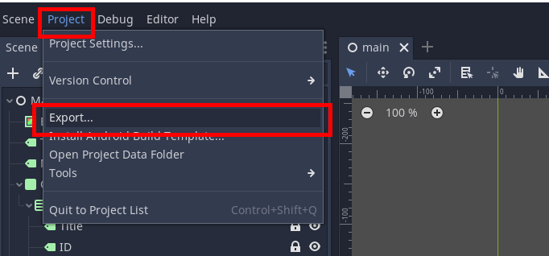
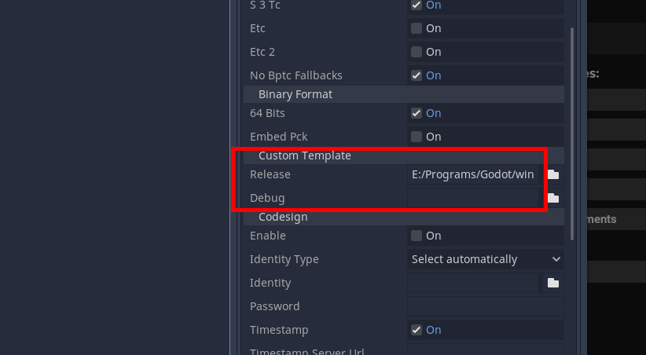
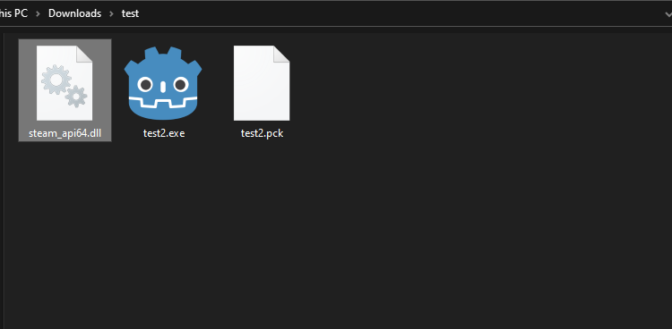
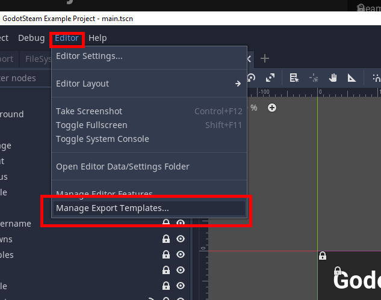
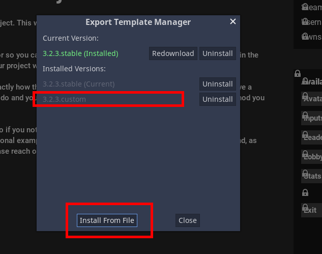

# Tutorials - Exporting and Shipping

This topic comes up a lot and _also_ trips folks up a lot; so this tutorial is here to help.

Exporting and shipping your game with GodotSteam is pretty easy once you get the flow down. This tutorial assumes you are downloading pre-compiled versions of the GodotSteam templates instead of compiling them; however, it will obviously work the same with the ones you compile yourself.

---

## Exporting for Modules / Pre-Compiles

To being our export process, first click on the "Project" button in the top menu then select "Export..." from the drop-down.

{ loading=lazy }

Since the pre-compiles are **never** debug-release versions, you must make sure that _only_ the **release field contains a template** and that the **debug field is empty**. this next step is important and also where people often get stuck:

{ loading=lazy }

If you have the debug field filled in, **especially while using the pre-compiled templates**, the export process will fail. Also, if you use a non-GodotSteam template here or leave the release field blank as well, you will end up with an executable that crashes like so:

````
Parse Error: The identifier "Steam" isn't declared in the current scope.
````

Obviously, because the Steamworks API isn't present without a GodotSteam template, the executable will not understand any Steam functions. Also take note that the OSX export screen has a reversed order for the debug and release fields, for some reason:

{ loading=lazy }

On the last export screen, just before the process begins, make sure you turn the debugging option off:

{ loading=lazy }

If you do not, your executable will crash since we are not using debug-release templates. That being said, if you compile the templates yourself and actually create debug-release templates then you can ignore both debug-specific parts above.

---

## Exporting for GDNative / GDExtension

If you are using the **GDNative or GDExtension** version of GodotSteam, you will need to use the **normal Godot templates** either installed throught the normal editor or downloaded from their site. Using the GodotSteam templates with the GDNative or GDExtension version will cause you a lot of issues.

Also take note of any additional files Godot exports for you like the godotsteam.dll / libgodotsteam.so / libgodotsteam.dylib because these must also be shipped with your game.

---

## Shipping

For Windows and Linux, shipping is relatively simple. You just need your game's executable, any accompanying .pck file, and the Steamworks API file.

=== "Windows"
	Use the **steam_api.dll** for 32-bit or **steam_api64.dll** for 64-bit.
=== "Linux"
	Make sure you use the **libsteam_api.so** file from the _correct_ folder. I am not sure why Valve did not differentiate, in naming, between 32 and 64-bit files for Linux, but they do not.
=== "macOS"
	The Steamworks redistributables are already included in your app directory so there's not thing else to add.

Your exported game's directory should look something like this:

{ loading=lazy }

At this point, you are ready to upload your game to Steam!  [You can read more about that process on the offical Steamworks SDK documentation.](https://partner.steamgames.com/doc/sdk/uploading){ target="_blank" }  And, as usual, if you run into any issues, please contact us on the project's GitHub issues page or the Discord server.

Let's also touch on some other small things next.

### No steam_appid.txt Needed

You will notice that the _steam_appid.txt_ is not included. This file is **only** used for running your game _outside_ of the Steam client so that it knows which game you are playing. When run _through_ the Steam client, Steam is aware of what game you are playing, thus it is not necessary. Valve recommends that you do not ship this file with your game, as [it can potentially cause issues](https://partner.steamgames.com/doc/api/steam_api#SteamAPI_RestartAppIfNecessary){ target="_blank" }.

### macOS Differences

There are a few extra steps beyond these since macOS games / apps are contained in an `.app` folder. Instead of repeating it here, you can [read more about the process in the Mac Exporting tutorial](mac_export.md).

### GDNative / GDExtension Caveats

As mentioned earlier, you will also need to include the godotsteam.dll / libgodotsteam.so / libgodotsteam.dylib file that was extracted during the exporting process.

---

## Template Importing (Optional)

As the title mentions, this step is completely optional. Personally, I do not import template zips when exporting games; however, I figured it was worth covering for those of you who do. And for those who do, there is now a separate template zip available in the GodotSteam release section which has all the operating system templates in one package.

Just like installing the official template zips, you want to click on the "Editor" option at the top then select "Manage Export Templates..." in the drop-down. Like so:

{ loading=lazy }

On the next screen you will want to click on the "Install From File" button and find your godotsteam-xxx-templates.tpz file. The editor will then install these templates so they will be available during export.

{ loading=lazy }

Despite "installing" the templates, you will still have to select them in the custom template fields during export; which is why this step is optional.
